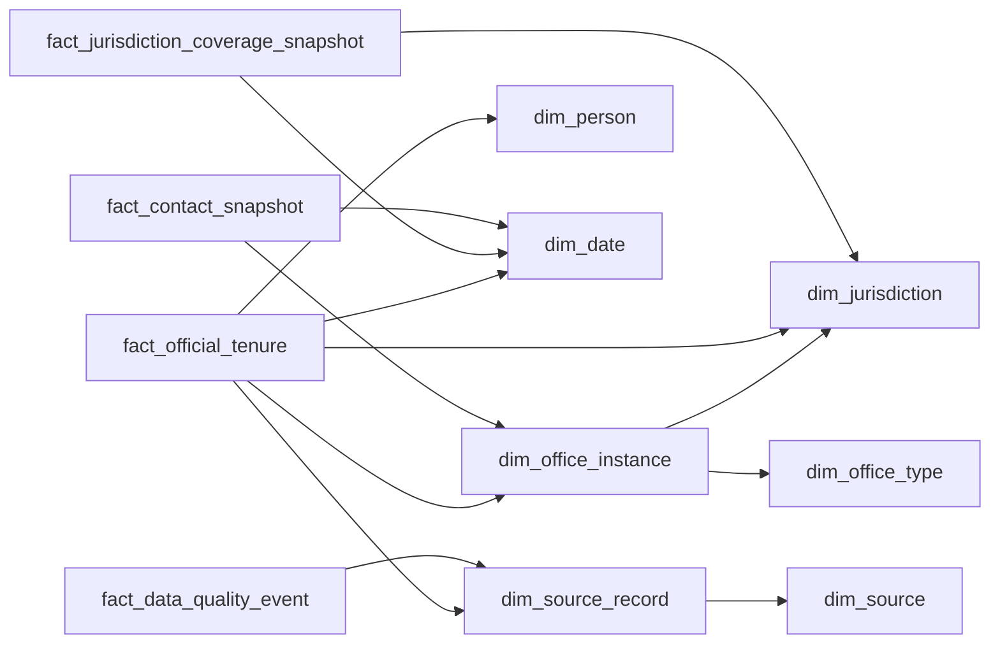

# Documentation

- **[part1-design.md](part1-design.md)** — Part 1 deliverable (data model, sources, collection approach, tradeoffs, AI usage template).

See the [repository README](../README.md) for the full brief and submission instructions.

---

## Dataset field model — dimensional (star)

This is a **star-oriented** dimensional design for analyst warehouses and BI tools. Surrogate keys (`*_dim_key`) are warehouse integers or hashes; `*_natural_id` ties back to operational systems. Dates use a conformed `**dim_date`**. Many attributes are nullable in practice; load unknowns explicitly and use `**fact_data_quality_event**` for caveats.

**Center of the star:** `fact_official_tenure` — one row per continuous assignment of one person to one county office seat (including acting or appointment fills if modeled).

### `dim_jurisdiction` (county / county-equivalent)

| Column                                   | Description                                                                   |
| ---------------------------------------- | ----------------------------------------------------------------------------- |
| `jurisdiction_dim_key`                   | Surrogate primary key.                                                        |
| `jurisdiction_natural_id`                | Stable operational ID (e.g., FIPS-based or internal).                         |
| `state_fips`                             | Two-digit state FIPS.                                                         |
| `county_fips`                            | Three-digit county FIPS within state.                                         |
| `county_fips_5`                          | Five-digit state+county FIPS (convenience).                                   |
| `geoid`                                  | Census GEOID for spatial joins (optional).                                    |
| `county_name`                            | Canonical display name.                                                       |
| `state_postal_code`                      | Two-letter state.                                                             |
| `county_class`                           | county, parish, borough, independent_city, etc.                               |
| `name_aliases`                           | Pipe- or JSON-delimited aliases if the warehouse stores flat text.            |
| `row_effective_date` / `row_expiry_date` | Optional SCD2 effective/expiry dates if boundaries or names change over time. |

### `dim_office_type` (normalized role)

| Column                    | Description                               |
| ------------------------- | ----------------------------------------- |
| `office_type_id`          | Primary key                               |
| `office_type_natural_id`  | Operational ID for the normalized role.   |
| `normalized_title`        | e.g. Sheriff, County Clerk, Commissioner  |
| `office_type_description` | Optional longer description.              |
| `external_taxonomy_code`  | Optional code from a partner or standard. |

### `dim_office_instance` (seat in a county)

| Column                       | Description                                          |
| ---------------------------- | ---------------------------------------------------- |
| `office_instance_dim_key`    | Surrogate primary key.                               |
| `office_instance_natural_id` | Operational ID for this seat.                        |
| `jurisdiction_dim_key`       | FK — county where this seat exists.                  |
| `office_type_dim_key`        | FK — normalized role for this seat.                  |
| `title_raw`                  | Title as printed on source sites.                    |
| `district_label`             | District id/label; blank if at-large.                |
| `seat_number`                | Multi-member at-large place number, if used.         |
| `is_elected`                 | elected / appointed / unknown.                       |
| `term_length_years`          | Term length in years if known from rules or sources. |
| `is_partisan`                | partisan / nonpartisan / unknown.                    |

### `dim_person`

| Column              | Description                          |
| ------------------- | ------------------------------------ |
| `person_dim_key`    | Surrogate primary key.               |
| `person_natural_id` | Operational person ID.               |
| `full_name`         | Display name.                        |
| `given_name`        | Parsed given name (optional).        |
| `middle_name`       | Parsed middle name (optional).       |
| `family_name`       | Parsed family name (optional).       |
| `suffix`            | Jr., III, etc.                       |
| `name_aliases`      | Delimited alternates if stored flat. |

*Optional:* SCD2 columns if legal name changes must be preserved for history.

### `dim_date` (conformed role calendar)

| Column          | Description                                      |
| --------------- | ------------------------------------------------ |
| `date_dim_key`  | Surrogate key (often `YYYYMMDD` integer).        |
| `calendar_date` | Actual calendar date.                            |
| `year`          | Calendar year.                                   |
| `quarter`       | Calendar quarter.                                |
| `month`         | Month of year.                                   |
| `day_of_month`  | Day of month.                                    |
| `day_of_week`   | Day of week (encoding per warehouse convention). |
| `is_weekend`    | Convenience flag for reporting.                  |

Use the same `dim_date` for tenure start, tenure end, coverage snapshot date, and contact effective date.

### `dim_source` (catalog of origins)

| Column              | Description                                                          |
| ------------------- | -------------------------------------------------------------------- |
| `source_dim_key`    | Surrogate primary key.                                               |
| `source_natural_id` | Operational source ID.                                               |
| `source_name`       | Human-readable label.                                                |
| `source_type`       | government_site, state_agency, third_party_aggregate, manual, other. |
| `trust_tier`        | A_primary, B_curated, C_secondary (policy-defined).                  |
| `base_url`          | Root URL if applicable.                                              |

### `dim_source_record` (one fetch / extract)

| Column                     | Description                                       |
| -------------------------- | ------------------------------------------------- |
| `source_record_dim_key`    | Surrogate primary key.                            |
| `source_record_natural_id` | Operational blob/extract ID.                      |
| `source_dim_key`           | FK — parent source.                               |
| `fetched_at`               | Timestamp when the system retrieved the evidence. |
| `source_as_of_text`        | “Last updated” text from page if present.         |
| `content_hash`             | Dedup / change detection.                         |
| `raw_payload_uri`          | Object storage pointer to raw payload.            |
| `parser_version`           | Parser version that produced structured fields.   |

---

### `fact_official_tenure` (primary fact)

**Grain:** one row per `tenure_natural_id` (one person in one `office_instance` for one continuous span).

| Column                          | Description                                                                                        |
| ------------------------------- | -------------------------------------------------------------------------------------------------- |
| `tenure_fact_key`               | Surrogate primary key for the fact row.                                                            |
| `tenure_natural_id`             | Degenerate — operational tenure id.                                                                |
| `office_instance_dim_key`       | FK — seat (`dim_office_instance`).                                                                 |
| `person_dim_key`                | FK — officeholder (`dim_person`).                                                                  |
| `jurisdiction_dim_key`          | FK — county (`dim_jurisdiction`); repeated for filter performance; must stay consistent with seat. |
| `role_start_date_dim_key`       | FK — `dim_date` for role start (unknown → unknown member or nullable FK per policy).               |
| `role_end_date_dim_key`         | FK — `dim_date` for role end; sentinel or NULL policy for incumbent.                               |
| `primary_source_record_dim_key` | FK — main evidence (`dim_source_record`) for this tenure row.                                      |
| `role_title_raw`                | Degenerate — title string from source.                                                             |
| `tenure_status`                 | Degenerate — incumbent, former, acting, appointed_fill, unknown.                                   |
| `party_affiliation`             | Degenerate — party as of this tenure; optional `dim_party` later.                                  |
| `entry_route`                   | Degenerate — general_election, special_election, appointment, succession, unknown.                 |
| `tenure_length_days`            | Measure — days from start to end when both known; else null.                                       |
| `is_current_flag`               | Measure — 1 if incumbent per ETL rule, else 0.                                                     |

*Semi-additive note:* Do not sum `is_current_flag` across arbitrary dimensions without defining the grain (e.g., one incumbent per seat).

### `fact_jurisdiction_coverage_snapshot` (operational / QA)

**Grain:** one row per county per **snapshot date** (e.g., daily ETL).

| Column                     | Description                                                    |
| -------------------------- | -------------------------------------------------------------- |
| `coverage_fact_key`        | Surrogate primary key for the fact row.                        |
| `jurisdiction_dim_key`     | FK — county.                                                   |
| `snapshot_date_dim_key`    | FK — as-of date for the metrics (`dim_date`).                  |
| `expected_office_cnt`      | Measure — expected seats from catalog or heuristic.            |
| `filled_office_cnt`        | Measure — seats with a current tenure.                         |
| `coverage_pct`             | Measure — `filled / expected` when expected > 0.               |
| `last_successful_fetch_ts` | Degenerate — latest successful pull timestamp for that county. |

### `fact_contact_snapshot` (optional, high churn)

**Grain:** one row per office (or tenure) per **effective date** per contact snapshot (or one row per extract — match refresh policy).

| Column                    | Description                                                              |
| ------------------------- | ------------------------------------------------------------------------ |
| `contact_fact_key`        | Surrogate primary key for the fact row.                                  |
| `office_instance_dim_key` | FK — seat.                                                               |
| `tenure_dim_key`          | FK — optional link to `fact_official_tenure.tenure_fact_key` if modeled. |
| `effective_date_dim_key`  | FK — when this contact row was true per source (`dim_date`).             |
| `source_record_dim_key`   | FK — evidence (`dim_source_record`).                                     |
| `phone`                   | Degenerate — phone as of snapshot.                                       |
| `email`                   | Degenerate — email as of snapshot.                                       |
| `mailing_address`         | Degenerate — mailing address as of snapshot.                             |
| `office_url`              | Degenerate — department/office URL.                                      |
| `profile_url`             | Degenerate — official profile URL.                                       |

### `fact_data_quality_event` (factless / audit)

**Grain:** one row per quality flag event (optionally only “open” flags).

| Column                          | Description                                                                                                     |
| ------------------------------- | --------------------------------------------------------------------------------------------------------------- |
| `quality_event_key`             | Surrogate primary key for the event row.                                                                        |
| `flag_natural_id`               | Degenerate — operational flag id.                                                                               |
| `entity_grain`                  | Degenerate — jurisdiction, office_instance, person, tenure, contact.                                            |
| `entity_natural_id`             | Degenerate — ID in operational layer.                                                                           |
| `flag_type`                     | Degenerate — stale, conflicting_sources, parse_uncertain, inferred_district, duplicate_person_suspected, other. |
| `severity`                      | Degenerate — info, warning, error.                                                                              |
| `field_name`                    | Degenerate — which attribute is suspect, if applicable.                                                         |
| `notes`                         | Degenerate — free-text detail.                                                                                  |
| `created_at`                    | Degenerate — when the flag was recorded.                                                                        |
| `related_source_record_dim_key` | FK — nullable evidence (`dim_source_record`) for the flag.                                                      |

### Bridge / current roster (optional mart)

`**mart_current_roster*`* — materialized join of `fact_official_tenure` (where `is_current_flag = 1`) to dimensions, for analyst extracts. Not a separate logical grain; avoids repeating ad hoc joins.

| Column              | Description                                                                                                   |
| ------------------- | ------------------------------------------------------------------------------------------------------------- |
| `export_attributes` | Denormalized keys and attributes from dims + fact degenerates needed for analyst export (define per product). |
| `last_verified_at`  | Max `fetched_at` from linked `dim_source_record`.                                                             |

### Relationship summary (logical)

| Column                                | Description                                                                                                                      |
| ------------------------------------- | -------------------------------------------------------------------------------------------------------------------------------- |
| `dim_office_instance`                 | Parents: `dim_jurisdiction`, `dim_office_type`. Snowflake-style; star still connects via instance.                               |
| `fact_official_tenure`                | Parents: `dim_office_instance`, `dim_person`, `dim_jurisdiction`, `dim_date` (start and end), `dim_source_record`. Primary star. |
| `dim_source_record`                   | Parent: `dim_source`. Provenance spine.                                                                                          |
| `fact_jurisdiction_coverage_snapshot` | Parents: `dim_jurisdiction`, `dim_date`. Coverage KPIs.                                                                          |
| `fact_contact_snapshot`               | Parents: `dim_office_instance`, `dim_date`, `dim_source_record`. Optional.                                                       |
| `fact_data_quality_event`             | Optional parent: `dim_source_record`. Audit / QA.                                                                                |

---

## Source strategy (placeholder)

Expand here or keep detailed narrative in [part1-design.md](part1-design.md) §2 — source tiers, trust criteria, and gap handling.