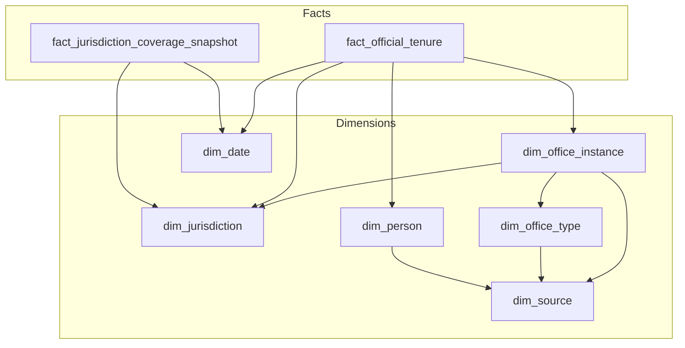

# Proposal for Elected Officials Data Acquisition

The purpose of this README is to outline a proposed approach to data acquisition and dataset modeling for U.S. county elected officials.

---

## Data Model

This is a proposed star schema dimensional data model for modeling elected official data.

The implementation of the dimensional modeling could be done using something like dbt or another data transformation tool. 

Note: I have chosen a relational database dimensional data model as the output of this data acquisition, but the final output should depend largely on the ultimate use of the data. For example, it may make more sense to have the data as something like json / parquet if it is going to be ingested by another tool.

An overview of the tables and how they are related can be found below, as well as more detailed information into description and proposed columns per table.

### `dim_jurisdiction`

This table stores information about each county including name, location information, and standardized codes.

| Column | Description |
|--------|-------------|
| `id` | Primary key. |
| `state_fips` | Two-digit state FIPS. |
| `county_fips` | Three-digit county FIPS within state. |
| `county_fips_5` | Five-digit state+county FIPS. |
| `geoid` | Census GEOID for spatial joins (optional). |
| `county_name` | Canonical display name. |
| `state_postal_code` | Two-letter state. |
| `county_class` | county, parish, borough, independent_city, etc. |
| `source_id` | Foreign key to `dim_source`. |
| `created_at` | Row created at datetime. |
| `updated_at` | Row updated at datetime. |
| `row_effective_date` / `row_expiration_date` | Optional Slowly Changing Dimension Type 2 effective/expiration dates if boundaries or names change over time. row_expiration_date is null if current record. |

Note: row_effective_data / row_expiration_date fields could be added to other tables as needed to track slowly changing dimensions.

### `dim_office_type`

This table stores the dimensional data for each office type. This is a useful dimension table given that different counties may have different offices.

| Column | Description |
|--------|-------------|
| `id` | Primary key. |
| `normalized_title` | e.g. Sheriff, County Clerk, Commissioner. |
| `office_type_description` | Optional longer description. |
| `source_id` | Foreign key to `dim_source`. |
| `created_at` | Row created at datetime. |
| `updated_at` | Row updated at datetime. |

### `dim_office_instance`

This table stores each instance of a specific office, for example in the case of multiple members of the same title.

| Column | Description |
|--------|-------------|
| `id` | Primary key. |
| `jurisdiction_id` | Foreign key to dim_jurisdiction; county where this seat exists. |
| `office_type_id` | Foreign key to dim_office_type; normalized role for this seat. |
| `title_raw` | Title as printed on source sites. |
| `seat_number` | Multi-member at-large place number, if used. |
| `is_elected` | elected / appointed / unknown |
| `term_length_years` | Term length in years if known from rules or sources. |
| `is_partisan` | partisan / nonpartisan / unknown |
| `source_id` | Foreign key to `dim_source`. |
| `created_at` | Row created at datetime. |
| `updated_at` | Row updated at datetime. |

### `dim_person`

This dimensional table contains the actual person level details, including full name and suffix.

| Column | Description |
|--------|-------------|
| `id` | Primary key. |
| `full_name` | Display name. |
| `given_name` | Parsed given name (optional). |
| `middle_name` | Parsed middle name (optional). |
| `family_name` | Parsed family name (optional). |
| `suffix` | Jr., III, etc. |
| `source_id` | Foreign key to `dim_source`. |
| `created_at` | Row created at datetime. |
| `updated_at` | Row updated at datetime. |

### `dim_date`

Conformed calendar dimension: one row per calendar day. Used for tenure start/end on `fact_official_tenure`, snapshot date on `fact_jurisdiction_coverage_snapshot`, and other date-grain reporting.

| Column | Description |
|--------|-------------|
| `id` | Primary key. |
| `calendar_date` | Calendar date. |
| `year` | Four-digit calendar year. |
| `quarter` | Calendar quarter (1–4). |
| `month` | Month of year (1–12). |
| `day_of_month` | Day of month (1–31). |
| `day_of_week` | Day of week (e.g. 1 = Monday … 7 = Sunday). 

### `dim_source`

This table contains a row for each possible data source. This is useful as a tracking and monitoring feature, allowing the ability to track where the data has been sourced from.

This table can also serve as a reference of all sources where data is being acquired from.

| Column | Description |
|--------|-------------|
| `id` | Primary key. |
| `source_name` | Human-readable label. |
| `source_type` | government_site, state_agency, third_party_aggregate, manual, other. |
| `trust_tier` | A_primary, B_curated, C_secondary. |
| `base_url` | Root URL if applicable. |
| `created_at` | Row created at datetime. |
| `updated_at` | Row updated at datetime. |

### `fact_official_tenure` (primary fact)

Primary fact table with each row representing one elected official's tenure. Joins to dimensional tables for more detailed dimensional data.

| Column | Description |
|--------|-------------|
| `id` | Primary key. |
| `dim_office_instance_id` | Foreign key to seat-level row in `dim_office_instance`. |
| `dim_person_id` | Foreign key to person details in `dim_person`. |
| `dim_jurisdiction_id` | Foreign key to county (`dim_jurisdiction`). |
| `role_start_date_dim_id` | Foregin key to `dim_date` for role start. |
| `role_end_date_dim_id` | Foregin key to `dim_date` for role end. |
| `role_title_raw` | Title string from source. |
| `tenure_status` | incumbent, former, acting, appointed_fill, unknown |
| `party_affiliation` | Party as of this tenure. |
| `entry_route` | general_election, special_election, appointment, succession, unknown |
| `tenure_length_days` | Days from start to end when both known; else null. |
| `is_current_flag` | Measure — 1 if incumbent per ETL rule, else 0. |
| `source_id` | Foreign key to `dim_source`. |
| `created_at` | Row created at datetime. |
| `updated_at` | Row updated at datetime. |

### `fact_jurisdiction_coverage_snapshot`

This QA table countains one row per county per snapshot date (e.g., daily ETL).

| Column | Description |
|--------|-------------|
| `id` | Primay key. |
| `jurisdiction_dim_id` | Foreign key to county (`dim_jurisdiction`). |
| `snapshot_date_dim_id` | Foreign key to as-of date for the metrics (`dim_date`). |
| `expected_office_count` | Measure — expected seats from catalog or heuristic. |
| `filled_office_count` | Measure — seats with a current tenure. |
| `coverage_pct` | Measure — `filled / expected` . |
| `last_successful_fetch_ts` | Latest successful pull timestamp for that county. |
| `created_at` | Row created at datetime. |
| `updated_at` | Row updated at datetime. |

---

## Source Strategy

A combination of sources would be used to acquire the needed data for all county elected officials.

These sources could include:

1. Official State and County Website data
2. Aggregated Data from Academic and Other Organizations (MIT Election Lab, etc.)
3. Additional internet search for information

To determine the ranking in reliability, I would cross reference multiple sources, as well as rely on input from subject matter experts. In general, I would prioritize official website data and aggregated academic data as most reliable.

## Collection Approach

For the collection of the data, a combination of approaches will be needed given the variety of data sources, including from PDF or html.

For the initial extraction of the raw data, ETL pipelines would be built primarily in python. This data might already be structured, but the majority will likely be semi or unstructured. A tool like dbt or other data transformation tool would then be used to transform the data into a more structured, standardized data model for downstream analytics and use cases.

The general pipelines would look like:
Python extractors --> Object storage + warehouse load --> dbt / SQL transformations

Also I would run the data collection in batch, since any real time data will likely not be needed.

In each part of the collection process, I would rely on AI tools where it made sense. For example, I would set up AI agents for discrete parts of the collection process.

Examples might include:

* For state and local website data, an AI agent to navigate to the URLs, click through the pages as needed, and scrape the information into structured data. Similarly with any PDF data sources.
* Agent to conduct internet search for individual state data.
* Agent to create inventory of data sources to pull from, which could then be used to orchestrate the python jobs to each source.

## Tradeoffs & Open Questions

### Key Questions

There are a few specific critical questions in designing an approach for this data acquisition project. I have provided some initial ideas and thoughts on these questions below; all should be evaluated and considered, though, throughout the development process.

1. How do we know the data is accurate? In cases of conflict between sources, what should happen? What does done look like?

* One approach to ensuring data accuracy will be to cross reference data sources, as well as define a heirarchy of source reliability.

* The way I have outlined the tables, there is a separate source id for each of the dimensions, which at this current point I think makes sense, but may evolve based on the data input.

* The monitoring will also be one of the most important parts to this data acquisition process. Testing and monitoring will be included to check for whether the data extraction has completed successfully and whether the structured data is as expected.

2. How do we know that data is complete? In case of incompleteness, how should this be reflected in the data and what is the threshold for good enough?

* The `fact_jurisdiction_coverage_snapshot` table is designed as a QA reference table to be able to see the completeness of data by jurisdiction.

3. How to best track changes in the data?

* One approach to tracking changes in the data could be to include slowly changing dimension fields within each table (see `dim_jurisdiction` as an example).

### Other Notes

In the data model section, I primarily defined the final (Gold) layer of the dimensional model, but likely there would be a need to have intermediate (Bronze and Silver) data layers with initial data cleanup and standardization. However, the specifics of these layers would depend largely on what the source data looks like, so I have not included details for the initial proposal.

## AI Usage Note

I used Cursor with different models for some specific parts of this task. Specifically, I used the Ask function to do some brainstorming and the Agent function for initial README structure, cleaning up formatting, etc. I reviewed all suggestions and changes before submission. The majority of the text I wrote myself after brainstorming and thinking through how I would approach the problem.

For the actual implementation, I would automate large parts of the workflow using Claude or equivvalent tools. I would use AI tools (or equivalent) for assistance in the python code development and automating different parts of the workflow, including:
1. crawling URLs
2. scraping web data
3. auditing data quality
4. documenting the project 